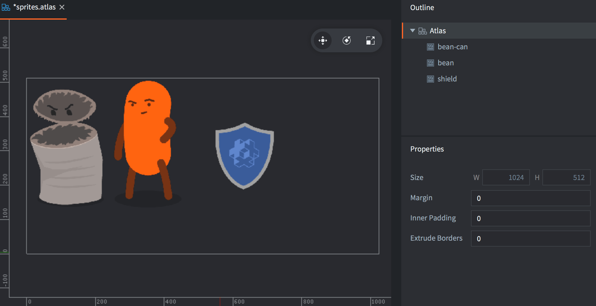
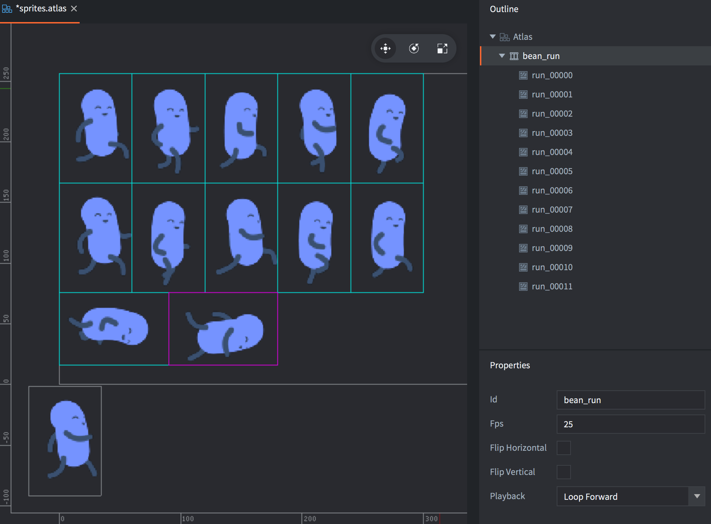

# Atlas

While single images are often used as source for sprites, for performance reasons, images need to be combined into larger sets of images, called atlases. Combining sets of smaller images into atlases is especially important on mobile devices where memory and processing power is more scarce than on desktop machines or dedicated game consoles.

In Defold, an atlas resource is a list of separate images files, which are automatically combined into a larger image.

## Creating an Atlas

Select <kbd>New... ▸ Atlas</kbd> from the context menu in the *Assets* browser. Name the new atlas file. The editor will now open the file in the atlas editor. The atlas properties are shown in the 
*Properties* pane so you can edit them (see below for details).

You need to populate an atlas with images or animations before you can use it as a graphics source for object components like Sprites and ParticleFX components.

Make sure that you have added your images to the project (drag and drop image files to the right location in the *Assets* browser)

Adding single images
: <kbd>Right click</kbd> the root Atlas entry in the *Outline* pane.
  
  Select <kbd>Add Images</kbd> from the pop up context menu to add single images.

  A dialog opens from which you can find and select the images you want to add to the Atlas. Note that you can filter the image files and select multiple files at once.

  

  The added images are listed in the *Outline* and the full atlas can be seen in the center editor view. You may need to press <kbd>F</kbd> (<kbd>View ▸ Frame Selection</kbd> from the menu) to reframe the selection.

  

Adding flip-book animations
: <kbd>Right click</kbd> the root Atlas entry in the *Outline* pane.

  Select <kbd>Add Animation Group</kbd> from the pop up context menu to create a flip book animation group.

  A new, empty, animation group with a default name ("New Animation") is added to the atlas.

  <kbd>Right click</kbd> then new group and select <kbd>Add Images</kbd> from the context menu.

  A dialog opens from which you can find and select the images you want to add to the animation group.
  
  

  Press <kbd>Space</kbd> with the animation group selected to preview it. Adjust the *Properties* for the animation as needed (see below).

  

You can reorder the images in the Outline by selecting them and pressing <kbd>Alt + Up/down</kbd>. You can also easily create duplicates by copying and pasting images in the outline (From the <kbd>Edit</kbd> menu, the right click context menu or keyboard shortcuts).

## Atlas properties

Each atlas resource has a set of properties. These are shown in the *Properties* pane when you select the root item in the *Outline* view.

Size
: Shows the computed total size of the resulting texture resource. The width and height are set to the closest power of two. Note that if you enable texture compression, some formats require square textures. Non square textures will then be resized and filled with empty space to make the texture square. See the [Texture profiles manual](/manuals/texture-profiles/) for details.

Margin
: The number of pixels that should be added between each image.

Inner Padding
: The number of empty pixels that should be padded around each image.

Extrude Borders
: The number of edge pixels that should be repeatedly padded around each image. When the fragment shader samples pixels at the edge of an image, pixels of a neighbor image (on the same atlas texture) may bleed over. Extruding the border solves this problem.

Here are examples of the different property settings with four square images of size 64x64 added to an atlas. Notice how the atlas jumps to 256x256 as soon as the images won't fit 128x128, resulting in much wasted texture space.

## Animation properties

In addition to the list of images that are part of an animation group, a set of properties are available:

Id
: The name of the animation.

Fps
: The playback speed of the animation, expressed in frames per second (FPS).

Flip horizontal
: Flips the animation horizontally.

Flip vertical
: Flips the animation vertically.

Playback
: Specifies how the animation should play:

  - `None` does not play back at all, the first image is displayed.
  - `Once Forward` plays the animation one time from the first to the last image.
  - `Once Backward` plays the animation one time from the last to the first image.
  - `Once Ping Pong` plays the animation one time from the first to the last image and then back to the first image.
  - `Loop Forward` plays the animation repeatedly from the first to the last image.
  - `Loop Backward` plays the animation repeatedly from the last to the first image.
  - `Loop Ping Pong` plays the animation repeatedly from the first to the last image and then back to the first image.
