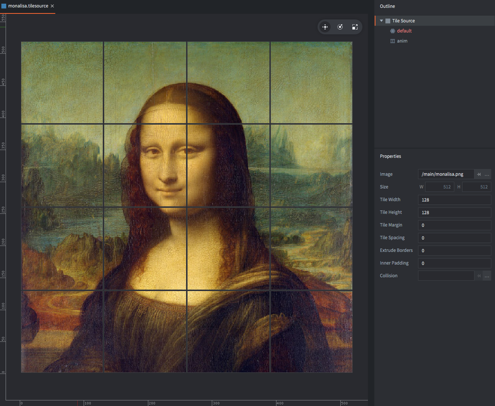
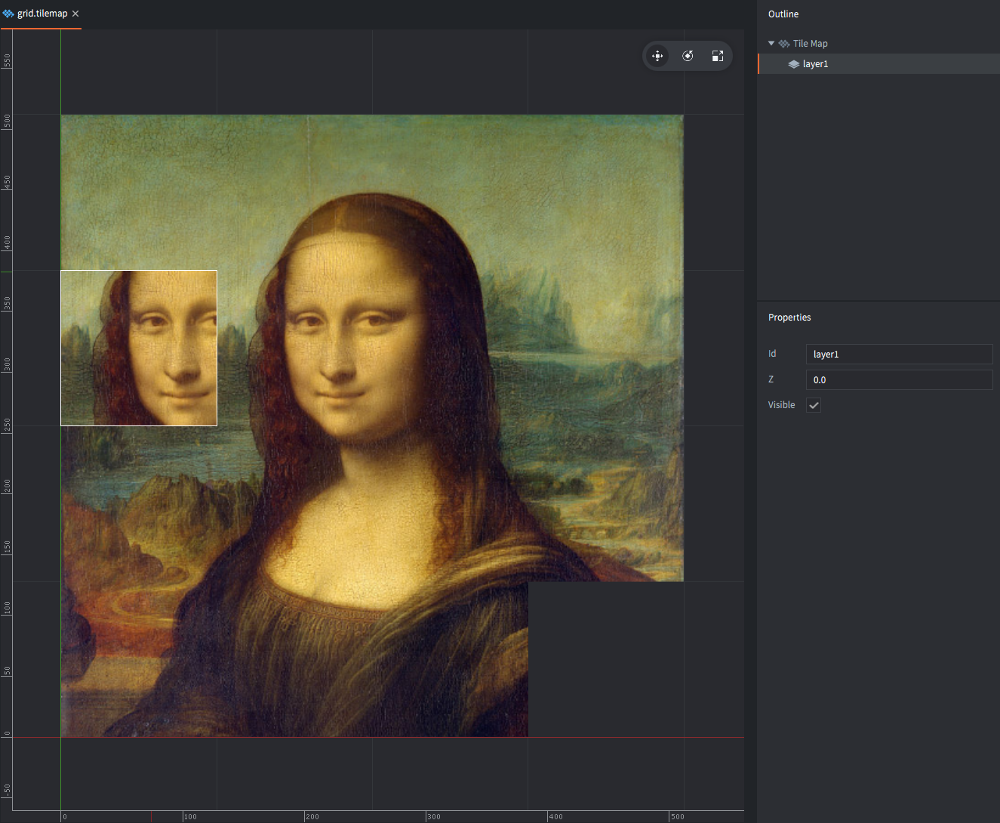
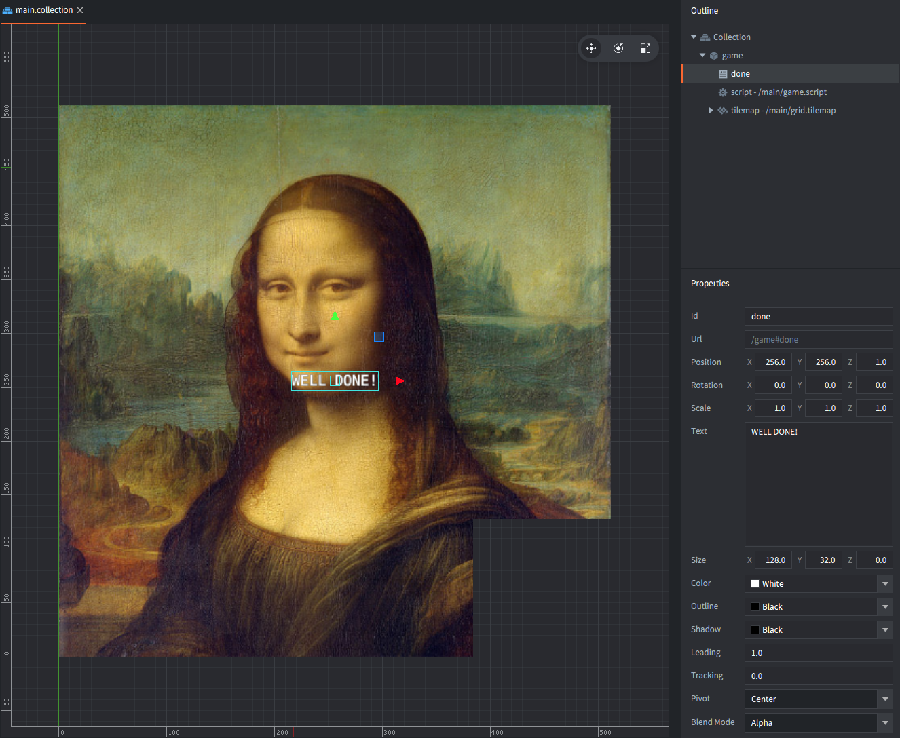
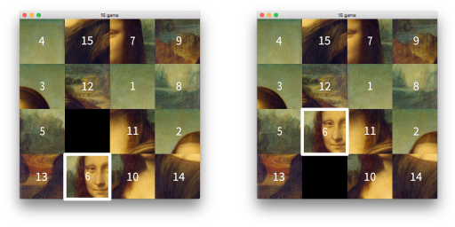

# The classic 15 puzzle

This well-known puzzle became popular in America during the 1870s. The goal of the puzzle is to organize the tiles on the board by sliding them horizontally and vertically. The puzzle starts from a position where the tiles have been scrambled.

The most common version of the puzzle shows the numbers 1--15 on the tiles. However, you can make the puzzle a bit more challenging by making the tiles part of an image. Before we begin, try to solve the puzzle. Click on a tile adjacent to the empty square to slide the tile to the empty position.

<div id="game-container" class="game-container">
  
  <canvas id="game-canvas" tabindex="1" width="512" height="512">
  </canvas>
  <button id="game-button">
    START GAME <span class="icon"></span>
  </button>
  <script src="//storage.googleapis.com/defold-doc/assets/dmloader.js"></script>
  <script src="//storage.googleapis.com/defold-doc/assets/dmengine_1_2_107.js" async></script>
  <script>
      /* Load app on click in container. */
      document.getElementById("game-button").onclick = function (e) {
          var extra_params = {
              archive_location_filter: function( path ) {
                  return ("//storage.googleapis.com/defold-doc/assets/15-puzzle" + path + "");
              },
              load_done: function() {},
              game_start: function() {
                  var e = document.getElementById("game-preview");
                  e.parentElement.removeChild(e);
              }
          }
          Module.runApp("game-canvas", extra_params);
          document.getElementById("game-button").style.display = 'none';
          document.getElementById("game-button").onclick = null;
      };
  </script>
</div>

## Creating the project

1. Start Defold.
2. Select *New Project* on the left.
3. Select the *From Template* tab.
4. Select *Empty Project*
5. Select a location for the project on your local drive.
6. Click *Create New Project*.

Open the *game.project* settings file and set the dimensions of the game to 512⨉512. These dimensions will match the image you are going to use.


The next step is to download a suitable image for the puzzle. Pick any square image but make sure to scale it to 512 by 512 pixels. If you don't want to go out and search for an image, here's one:


Download the image, then drag it to the *main* folder of your project.

## Representing the grid

Defold contains a built in *Tilemap* component that is perfect for visualizing the puzzle board. Tilemaps allow you to set and read individual tiles, which is all you need for this project.

But before you create the tilemap, you need a *Tilesource* that the tilemap will pull its tile images from.

<kbd>Right click</kbd> the *main* folder and select <kbd>New ▸ Tile Source</kbd>. Name the new file "monalisa.tilesource".

Set the tile *Width* and *Height* properties to 128. This will split the 512⨉512 pixel image into 16 tiles. The tiles will be numbered 1--16 when you put them on the tilemap.



Next, <kbd>Right click</kbd> the *main* folder and select <kbd>New ▸ Tile Map</kbd>. Name the new file "grid.tilemap".

Defold needs you to initialize the grid. To do that, select the "layer1" layer and paint the 4⨉4 grid of tiles just to the top-right of origin. It does not really matter what you set the tiles to. You will write code in a bit that will set the content of these tiles automatically. 



## Putting the pieces together

Open *main.collection*. <kbd>Right click</kbd> the root node in the *Outline* and select <kbd>Add Game Object</kbd>. Set the *Id* property of the new game object to "game".

<kbd>Right click</kbd> the game object and select <kbd>Add Component File</kbd>. Select the file *grid.tilemap*.

<kbd>Right click</kbd> the game object and select <kbd>Add Component ▸ Label</kbd>. Set the *Id* property of the label to "done" and its *Text* property to "Well done". Move the label to the center of the tilemap.

Set the Z position of the label to 1 to make sure it's drawn on top of the grid.



Next, create a Lua script file for the puzzle logic: <kbd>right click</kbd> the *main* folder and select <kbd>New ▸ Script</kbd>. Name the new file "game.script".

Then <kbd>Right click</kbd> the game object called "game" in *main.collection* and select <kbd>Add Component File</kbd>. Select the file *game.script*.

Run the game. You should see the grid as you drew it and the label with the "Well done" message on top.

## The puzzle logic

Now you have all the pieces in place so the rest of the tutorial will be spent putting together the puzzle logic.

The script will carry its own representation of the board tiles, separate from the tilemap. That is because it is possible to make it easier to operate on. Instead of storing the tiles in a 2 dimensional array, the tiles are stored as a one dimensional list in a Lua table. The list contains the tile number in sequence, starting from the top left corner of the grid all the way to the bottom right:

```lua
-- The completed board looks like this:
self.board = {1, 2, 3, 4, 5, 6, 7, 8, 9, 10, 11, 12, 13, 14, 15, 0}
```

The code that takes such a list of tiles and draws it on our tilemap is pretty simple but needs to convert the position in the list to a x and y position:

```lua
-- Draw a table list of tiles onto a 4x4 tilemap
local function draw(t)
    for i=1, #t do
        local y = 5 - math.ceil(i/4) -- <1>
        local x = i - (math.ceil(i/4) - 1) * 4
        tilemap.set_tile("#tilemap","layer1",x,y,t[i])
    end
end
```
1. In tilemaps, the tile with x-value 1 and y-value 1 is at the bottom left. Therefore the y position needs to be inverted.

You can check that the function works as intended by creating a test `init()` function:

```lua
function init(self)
    -- An inverted board, for test
    self.board = {15, 14, 13, 12, 11, 10, 9, 8, 7, 6, 5, 4, 3, 2, 1, 0}
    draw(self.board)
end
```

With the tiles in a Lua table list, scrambling the order is super easy. The code just runs through each element in the list and switches each tile with another randomly chosen tile:

```lua
-- Swap two items in a table list
local function swap(t, i, j)
    local tmp = t[i]
    t[i] = t[j]
    t[j] = tmp
    return t
end

-- Randomize the order of a the elements in a table list
local function scramble(t)
    for i=1, #t do
        t = swap(t, i, math.random(#t))
    end
    return t
end
```

Before moving on, there's a thing about the 15 puzzle that you really need to consider: if you randomize the tile order like you are doing above, there is a 50% chance that the puzzle is *impossible* to solve.

This is bad news since you definitely don't want to present the player with a puzzle that cannot be solved.

Fortunately, it is possible to figure out whether a setup is solvable or not. Here's how:

## Solvability

In order to figure out if a position in a 4⨉4 puzzle is solvable, two pieces of information are needed:

1. The number of "inversions" in the setup. An inversion is when a tile precedes another tile with a lower number on it. For example, given the list `{1, 2, 3, 4, 5, 6, 7, 8, 9, 12, 11, 10, 13, 14, 15, 0}`, it has 3 inversions:

    - the number 12 has 11 and 10 following it, giving 2 inversions.
    - the number 11 has 10 following it, giving 1 more inversion.

    (Note that the solved puzzle state has zero inversions)

2. The row where the empty square is (denoted by `0` in the list).

These two numbers can be calculated with the following functions:

```lua
-- Count the number of inversions in a list of tiles
local function inversions(t)
    local inv = 0
    for i=1, #t do
        for j=i+1, #t do
            if t[i] > t[j] and t[j] ~= 0 then -- <1>
                inv = inv + 1
            end
        end
    end
    return inv
end
```
1. Note that the empty square does not count.

```lua
-- Find the x and y position of a given tile
local function find(t, tile)
    for i=1, #t do
        if t[i] == tile then
            local y = 5 - math.ceil(i/4) -- <1>
            local x = i - (math.ceil(i/4) - 1) * 4
            return x,y
        end
    end
end
```
1. Y position from the bottom.

Now, given these two numbers it is possible to tell if a puzzle state is solvable or not. A 4⨉4 board state is *solvable* if:

- If the empty square is on an *odd* row (1 or 3 counting from the bottom) and the number of inversions is *even*.
- If the empty square is on an *even* row (2 or 4 counting from the bottom) and the number of inversions is *odd*.

## How does this work?

Each legal move moves a piece by switching its place with the empty square either horizontally or vertically.

Moving a piece horizontally does not change the number of inversions, nor does it change the row number where you find the empy square.

Moving a piece vertically, however, changes the parity of the number of inversions (from odd to even, or from even to odd). It also changes the parity of the empty square row.

For example:



This move changes the tile order from:

`{ ... 0, 11, 2, 13, 6 ... }`

to

`{ ... 6, 11, 2, 13, 0 ... }`

The new state adds 3 inversions as follows:

- The number 6 adds 1 inversion (the number 2 is now after 6)
- The number 11 loses 1 inversion (the number 6 is now before 11)
- The number 13 loses 1 inversion (the number 6 is now before 13)

The possible ways the number of inversions can change by a vertical slide is by ±1 or ±3.

The possible ways the empty square row can change by a vertical slide is by ±1.

In the final state of the puzzle, the empty square is in the lower right corner (the *odd* row 1) and the number of inversions is the *even* value 0. Each legal move either leave these two values intact (horizontal move) or switches their polarity (vertical move). No legal move can ever make the polarity of the inversions and the empty square row *odd*, *odd* or *even*, *even*.

Any puzzle state where the two numbers are both odd or both even is therefore impossible to solve.

Here is the code that checks for solvability:

```lua
-- Is the given table list of 4x4 tiles solvable?
local function solvable(t)
    local x,y = find(t, 0)
    if y % 2 == 1 and inversions(t) % 2 == 0 then
        return true
    end
    if y % 2 == 0 and inversions(t) % 2 == 1 then
        return true
    end
    return false    
end
```

## User input

The only thing left to do now is to make the puzzle interactive.

Create an `init()` function that does all the runtime setup using the functions created above:

```lua
function init(self)
    msg.post(".", "acquire_input_focus") -- <1>
    math.randomseed(socket.gettime()) -- <2>
    self.board = scramble({1, 2, 3, 4, 5, 6, 7, 8, 9, 10, 11, 12, 13, 14, 15, 0}) -- <3>
    while not solvable(self.board) do -- <4>
        self.board = scramble(self.board)
    end
    draw(self.board) -- <5>
    self.done = false -- <6>
    msg.post("#done", "disable") -- <7>
end
```
1. Tell the engine that this game object should receive input.
2. Seed the randomizer.
3. Create an initial random state for the board.
4. If the state is unsolvable, scramble again.
5. Draw the board.
6. Set a completion flag to track winning state.
7. Disable the completion message label.

Open */input/game.input_bindings* and add a new *Mouse Trigger*. Set the name of the action to "press":


Go back to the script and create an `on_input()` function.

```lua
-- Deal with user input
function on_input(self, action_id, action)
    if action_id == hash("press") and action.pressed and not self.done then -- <1>
        local x = math.ceil(action.x / 128) -- <2>
        local y = math.ceil(action.y / 128)
        local ex, ey = find(self.board, 0) -- <3>
        if math.abs(x - ex) + math.abs(y - ey) == 1 then -- <4>
            self.board = swap(self.board, (4-ey)*4+ex, (4-y)*4+x) -- <5>
            draw(self.board) -- <6>
        end
        ex, ey = find(self.board, 0)
        if inversions(self.board) == 0 and ex == 4 then -- <7>
            self.done = true
            msg.post("#done", "enable")
        end
    end
end
```
1. If there is a mouse button press and the game is still running, do the following.
2. Calculate the x and y square that the user has clicked.
3. Find the current location of the empty (0) square.
4. If the clicked square is on the square is right above, below, left or right of the empty one, do the following:
5. Switch the tiles on the clicked square and the empty one.
6. Redraw the updated board.
7. If the number of inversions on the board is 0, meaning that everything is in the right order, and the empty square is at the rightmost column (it must be on the last row for the inversions to be 0) then the puzzle is solved so do the following:
8. Set the completion flag.
9. Enable/show the completion message.

And that's it! You are done, the puzzle game is complete!

## The complete script

Here is the complete script code for reference:

```lua
local function inversions(t)
    local inv = 0
    for i=1, #t do
        for j=i+1, #t do
            if t[i] > t[j] and t[j] ~= 0 then
                inv = inv + 1
            end
        end
    end
    return inv
end

local function find(t, tile)
    for i=1, #t do
        if t[i] == tile then
            local y = 5 - math.ceil(i/4)
            local x = i - (math.ceil(i/4) - 1) * 4
            return x,y
        end
    end
end

local function solvable(t)
    local x,y = find(t, 0)
    if y % 2 == 1 and inversions(t) % 2 == 0 then
        return true
    end
    if y % 2 == 0 and inversions(t) % 2 == 1 then
        return true
    end
    return false    
end

local function scramble(t)
    for i=1, #t do
        local tmp = t[i]
        local r = math.random(#t)
        t[i] = t[r]
        t[r] = tmp
    end
    return t
end

local function swap(t, i, j)
    local tmp = t[i]
    t[i] = t[j]
    t[j] = tmp
    return t
end

local function draw(t)
    for i=1, #t do
        local y = 5 - math.ceil(i/4)
        local x = i - (math.ceil(i/4) - 1) * 4
        tilemap.set_tile("#tilemap","layer1",x,y,t[i])
    end
end

function init(self)
    msg.post(".", "acquire_input_focus")
    math.randomseed(socket.gettime())
    self.board = scramble({1, 2, 3, 4, 5, 6, 7, 8, 9, 10, 11, 12, 13, 14, 15, 0})   
    while not solvable(self.board) do
        self.board = scramble(self.board)
    end
    draw(self.board)
    self.done = false
    msg.post("#done", "disable")
end

function on_input(self, action_id, action)
    if action_id == hash("press") and action.pressed and not self.done then
        local x = math.ceil(action.x / 128)
        local y = math.ceil(action.y / 128)
        local ex, ey = find(self.board, 0)
        if math.abs(x - ex) + math.abs(y - ey) == 1 then
            self.board = swap(self.board, (4-ey)*4+ex, (4-y)*4+x)
            draw(self.board)
        end
        ex, ey = find(self.board, 0)
        if inversions(self.board) == 0 and ex == 4 then
            self.done = true
            msg.post("#done", "enable")
        end
    end
end

function on_reload(self)
    self.done = false
    msg.post("#done", "disable")    
end
```

## Further exercises

1. Make a 5⨉5 puzzle, then a 6⨉5 one. Make sure the solvability checks work generally.
2. Add sliding animations. Tiles cannot be moved separately from the tilemap so you will have to come up with a way of solving that. Perhaps a separate tilemap that only contains the sliding piece?
