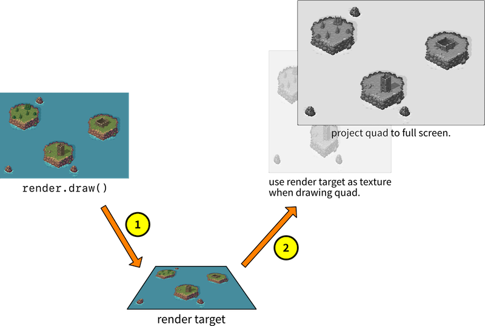
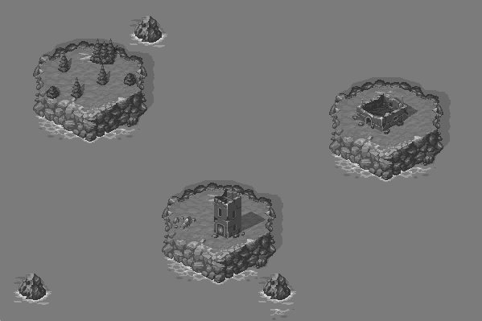
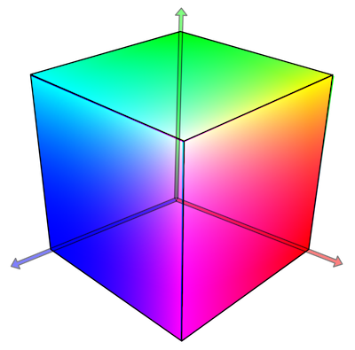
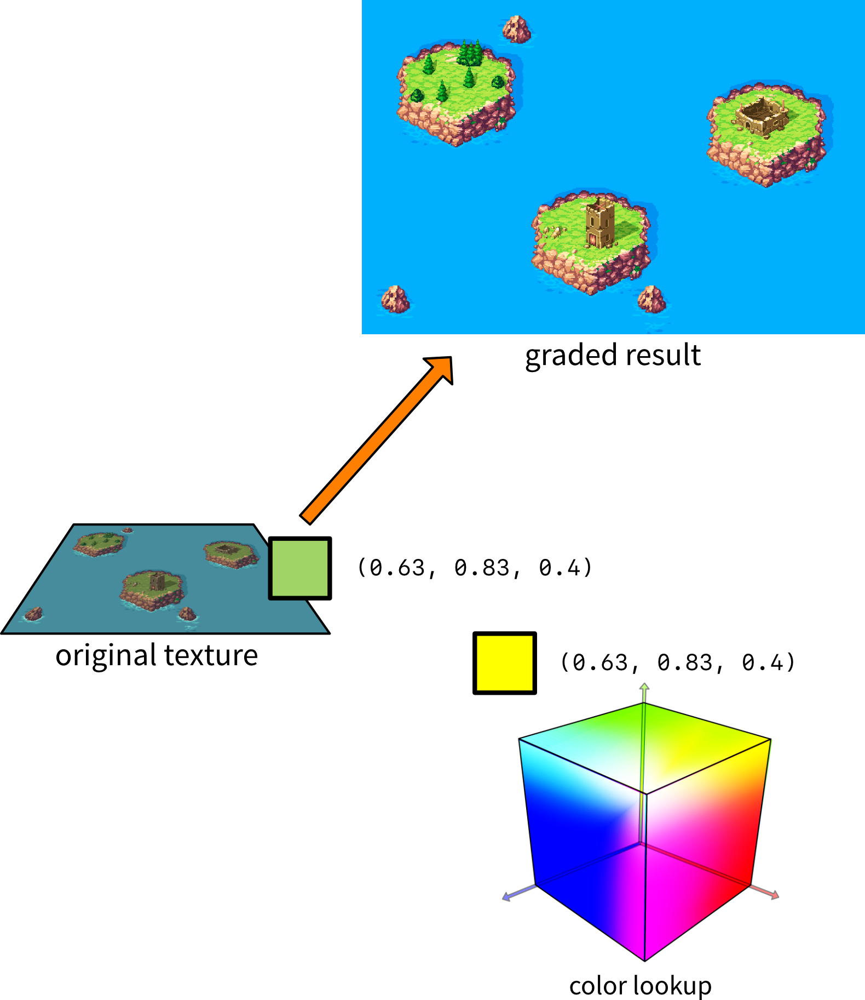
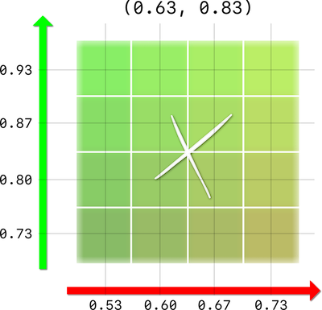
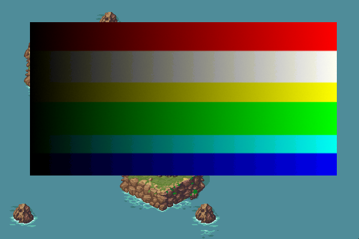
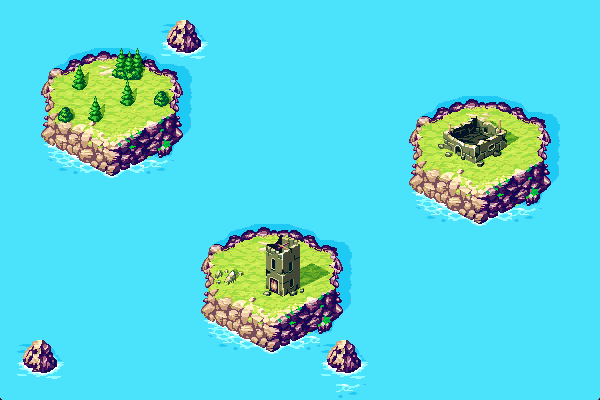

# Grading tutorial

In this tutorial we are going to create a color grading  full screen post effect. The basic rendering method used is widely applicable for various types of post effects like blur, trails, glow, color adjustments and so on.

It is assumed that you know your way around the Defold editor, and that you have basic understanding of GL shaders and the Defold rendering pipeline. If you need to read up on these subjects, check out [our Shader manual](/manuals/shader/) and the [Render manual](/manuals/render/).

## Render targets

With the default render script, each visual component (sprite, tilemap, particle effect, GUI etc) is rendered directly to the graphics card's *frame buffer*. The hardware then cause the graphics to appear on the screen. The actual drawing of a component's pixels is done by a GL *shader program*. Defold ships with a default shader program for each component type that draws the pixel data to the screen untouched. Normally, this is the behavior you want---your images should appear on the screen as they were originally conceived.

You can replace a component's shader program with one that modifies the pixel data, or creates wholly new pixel colors programmatically. The [Shadertoy tutorial](/tutorials/shadertoy) teaches you how to do that.

Now let's say that you want to render your whole game in black-and-white. One possible solution is to modify the individual shader program for each components type so that each shader desaturates pixel colors. Currently, Defold ships with 6 built in materials and 6 vertex and fragment shader program pairs so it will take a fair amount of work. Furthermore, any subsequent changes or effect additions has to be made to each shader program.

A much more flexible approach is to instead do the rendering in two separate steps:



1. Draw all components as usual, but draw them to an off-screen buffer instead of the usual frame buffer. You do this by drawing to something called a *render target*.
2. Draw a square polygon to the frame buffer and use the pixel data stored in the render target as the polygon's texture source. Also make sure that the square polygon is stretched to cover the whole screen.

With this method, we are able to read the resulting visual data and modify it before it hits the screen. By adding shader programs to step 2 above, we can easily achieve full screen effects. Let's see how to set this up in Defold.

## Setting up a custom renderer

We need to modify the built in render script and add the new rendering functionality. The default render script is a good starting point so start by copying it:

1. Copy */builtins/render/default.render_script*: In the *Asset* view, right click *default.render_script*, select <kbd>Copy</kbd> then right click *main* and select <kbd>Paste</kbd>. Right click the copy and select <kbd>Rename...</kbd> and give it a suitable name, like "grade.render_script".
2. Create a new render file called */main/grade.render* by right clicking *main* in the *Asset* view and selecting <kbd>New ▸ Render</kbd>.
3. Open *grade.render* and set its *Script* property to "/main/grade.render_script".

   

4. Open *game.project* and set *Render* to "/main/grade.render".

   

Now the game is set up to run with a new render pipeline that we can modify. To test that our render script copy is used by the engine, run your game, then do a modification to the render script that will give a visual result, and then reload the script. For example, you can disable the drawing of tiles and sprites, then press <kbd>⌘ + R</kbd> to hot-relad the "broken" render script into the running game:

```lua
...

render.set_projection(vmath.matrix4_orthographic(0, render.get_width(), 0, render.get_height(), -1, 1))

-- render.draw(self.tile_pred) -- <1>
render.draw(self.particle_pred)
render.draw_debug3d()

...
```
1. Comment out drawing of the "tile" predicate, which includes all sprites and tiles. This line of code can be found around line 33 in the render script file.

If the sprites and tiles disappear by this simple test you know that the game runs your render script. If everything works as expected you can undo the change to the render script.

## Drawing to an off-screen target

Now, let's modify the render script so that it draws to the off-screen render target instead of the frame buffer. First we need to create the render target:

```lua
function init(self)
    self.tile_pred = render.predicate({"tile"})
    self.gui_pred = render.predicate({"gui"})
    self.text_pred = render.predicate({"text"})
    self.particle_pred = render.predicate({"particle"})

    self.clear_color = vmath.vector4(0, 0, 0, 0)
    self.clear_color.x = sys.get_config("render.clear_color_red", 0)
    self.clear_color.y = sys.get_config("render.clear_color_green", 0)
    self.clear_color.z = sys.get_config("render.clear_color_blue", 0)
    self.clear_color.w = sys.get_config("render.clear_color_alpha", 0)

    self.view = vmath.matrix4()

    local color_params = { format = render.FORMAT_RGBA,
                       width = render.get_width(),
                       height = render.get_height() } -- <1>
    local target_params = {[render.BUFFER_COLOR_BIT] = color_params }

    self.target = render.render_target("original", target_params) -- <2>
end
```
1. Set up color buffer parmeters for the render target. We use the game's target resolution.
2. Create the render target with the color buffer parameters.

Now we just need to wrap the original rendering code with `render.enable_render_target()` and `render.disable_render_target()`:

```lua
function update(self)
  render.enable_render_target(self.target) -- <1>

  render.set_depth_mask(true)
  render.set_stencil_mask(0xff)
  render.clear({[render.BUFFER_COLOR_BIT] = self.clear_color, [render.BUFFER_DEPTH_BIT] = 1, [render.BUFFER_STENCIL_BIT] = 0})

  render.set_viewport(0, 0, render.get_width(), render.get_height()) -- <2>
  render.set_view(self.view)
  ...

  render.disable_render_target(self.target) -- <3>
end
```
1. Enable the render target. From now on, every call to `render.draw()` will draw to our off-screen render target's buffers.
2. All original drawing code in `update()` is left as is, apart from the viewport which is set to the render target's resolution.
3. At this point, all the game's graphics has been drawn to the render target. So it's time to disable it.

That's all we need to do. If you run the game now it will draw everything to the render target. But since we now drawing nothing to the frame-buffer we will only see a black screen.

## Something to fill the screen with

To draw the pixels in the render target's color buffer onto the screen, we need to set something up that we can texture with the pixel data. For that purpose we are going to use a flat, quadratic 3D model.

Create a quadratic plane mesh in Blender (or any other 3D modelling program). Set the vertex coordinates to -1 and 1 on the X-axis and -1 and 1 on the Y axis. Blender has the Z-axis up by default so you need to rotate the mesh 90° around the X-axis. You should also make sure that you generate correct UV-coordinates for the mesh. In Blender, enter Edit Mode with the mesh selected, then select <kbd>Mesh ▸ UV unwrap... ▸ Unwrap</kbd>.


1. Export the model as a Collada file called *quad.dae* and drag it into your Defold project.
2. Open *main.collection* and create a new game object called "grade".
3. Add a Model component to the "grade" game object.
3. Set the *Mesh* property of the model component to the *quad.dae* file.

Leave the game object unscaled at origin. Later, when we render the quad we will project it so it fills the whole screen. But first we need a material and shader programs for the quad:

1. Create a new material and call it *grade.material* by right clicking *main* in the *Asset* view and selecting <kbd>New ▸ Material</kbd>.
2. Create a vertex shader program called *grade.vp* and a fragment shader program called *grade.fp* by right clicking *main* in the *Asset* view and selecting <kbd>New ▸ Vertex program</kbd> and <kbd>New ▸ Fragment program</kbd>.
3. Open *grade.material* and set the *Vertex program* and *Fragment program* properties to the new shader program files.
4. Add a *Vertex constant* named "view_proj" of type `CONSTANT_TYPE_VIEWPROJ`. This is the view and projection matrix used in the vertex program for the quad vertices.
5. Add a *Sampler* called "original". This will be used to sample pixels from the off-screen render target color buffer.
6. Add a *Tag* called "grade". We will make a new *render predicate* in the render script matching this tag to draw the quad.

   

7. Open *main.collection*, select the model component in game object "grade" and set its *Material* property to "/main/grade.material".

   

8. The vertex shader program can be left as created from the base template:

    ```glsl
    // grade.vp
    uniform mediump mat4 view_proj;

    // positions are in world space
    attribute mediump vec4 position;
    attribute mediump vec2 texcoord0;

    varying mediump vec2 var_texcoord0;

    void main()
    {
      gl_Position = view_proj * vec4(position.xyz, 1.0);
      var_texcoord0 = texcoord0;
    }
    ```

9. In the fragment shader program, instead of setting `gl_FragColor` to the sampled color value directly, let's perform a simple color manipulation. We do this mainly to make sure everything works as expected so far:

    ```glsl
    // grade.fp
    varying mediump vec4 position;
    varying mediump vec2 var_texcoord0;

    uniform lowp sampler2D original;

    void main()
    {
      vec4 color = texture2D(original, var_texcoord0.xy);
      // Desaturate the color sampled from the original texture
      float grey = color.r * 0.3 + color.g * 0.59 + color.b * 0.11;
      gl_FragColor = vec4(grey, grey, grey, 1.0);
    }
    ```

Now we have the quad model in place with its material and shaders. We just have to draw it to the screen frame buffer.

## Texturing with the off-screen buffer

We need to add a render predicate to the render script so we can draw the quad model. Open *grade.render_script* and edit the `init()` function:

```lua
function init(self)
    self.tile_pred = render.predicate({"tile"})
    self.gui_pred = render.predicate({"gui"})
    self.text_pred = render.predicate({"text"})
    self.particle_pred = render.predicate({"particle"})
    self.grade_pred = render.predicate({"grade"}) -- <1>

    ...
end
```
1. Add a new predicate matching the "grade" tag that we set in *grade.material*.

After the render target's color buffer has been filled in `update()` we set up a view and a projection that make the quad model fill the whole screen. We then use the render target's color buffer as the quad's texture:

```lua
function update(self)
  render.enable_render_target(self.target)

  ...

  render.disable_render_target(self.target)

  render.clear({[render.BUFFER_COLOR_BIT] = self.clear_color}) -- <1>

  render.set_viewport(0, 0, render.get_window_width(), render.get_window_height()) -- <2>
  render.set_view(vmath.matrix4()) -- <3>
  render.set_projection(vmath.matrix4())

  render.enable_texture(0, self.target, render.BUFFER_COLOR_BIT) -- <4>
  render.draw(self.grade_pred) -- <5>
  render.disable_texture(0, self.target) -- <6>
end
```
1. Clear the frame buffer. Note that the previous call to `render.clear()` affects the render target, not the screen frame buffer.
2. Set the viewport to match the window size.
3. Set the view to the identity matrix. This means camera is at origin looking straight along the Z axis. Also set the projection to the identity matrix causing the the quad to be projected flat across the whole screen.
4. Set texture slot 0 to the color buffer of the render target. We have sampler "original" at slot 0 in our *grade.material* so the fragment shader will sample from the render target.
5. Draw the predicate we created matching any material with the tag "grade". The quad model uses *grade.material* which sets that tag---thus the quad will be drawn.
6. After drawing, disable texture slot 0 since we are done drawing with it.

Now let's run the game and see the result:



## Color grading

Colors are expressed as three component values where each component dictates the amount of red, green or blue a color consist of. The full color spectrum from black, through red, green, blue, yellow and pink to white can be fit into a cube shape:



Any color that can be displayed on screen can be found in this color cube. The basic idea of color grading is to use such a color cube, but with altered colors, as a 3D *lookup table*.

For each pixel:

1. Look up its color's position in the color cube (based on the red, green and blue values).
2. *Read* what color the graded cube has stored in that location.
3. Draw the pixel in the read color instead of the original color.

We can do this in our fragment shader:

1. Sample the color value for each pixel in the off-screen buffer.
2. Look up the color position of the sampled pixel in a color-graded color cube.
3. Set the output fragment color to the looked up value.



## Representing the lookup table

Open GL ES 2.0 does not support 3D textures so we need to figure out another way to represent the 3D color cube. A common way of doing that is to slice the cube along the Z-axis (blue) and lay each slice side by side in a 2-dimensional grid. Each of the 16 slices contains a 16⨉16 pixel grid. We store this in a texture that we can read from in the fragment shader with a sampler:


The resulting texture contains 16 cells (one for each blue color intensity) and within each cell 16 red colors along the X axis and 16 green colors along the Y axis. The texture represents the whole 16 million color RGB color space in just 4096 colors---merely 4 bits of color depth. By most standards this lousy but thanks to a feature of GL graphics hardware we can get very high color accuracy back. Let's see how.

## Looking up colors

To look up a color is a matter of checking the blue component and figure out which cell to pick the red and green values from. The formula for finding the cell with the right red-green color set is simple:

$$
cell = \left \lfloor{B \times (N - 1)} \right \rfloor
$$

Here `B` is the blue component value between 0 and 1 and `N` is the total number of cells. In our case the cell number will be in the range `0`--`15` where cell `0` contains all colors with the blue component at `0` and cell `15` all colors with the blue component at `1`.

For example, the RGB value `(0.63, 0.83, 0.4)` is found in the cell containing all the colors with a blue value of `0.4`, which is cell number 6. Knowing that, the lookup of the final texture coordinates based on the green and red values is straightforward:


Note that we need to treat red and green values `(0, 0)` as being in the *center* of the bottom left pixel and the values `(1.0, 1.0)` as being in the *center* of the top right pixel.

<div class='sidenote' markdown='1'>
The reason we read starting at the center of the lower left pixel and up to the center of the top right one is that we don't want any pixels outside of the current cell to affect the sampled value. See below about filtering.
</div>

When sampling at these specific coordinates on the texture we see that we end up right between 4 pixels. So what color value will GL tell us that point has?



The answer depends on how we have specified the sampler's *filtering* in the material.

- If the sampler filtering is `NEAREST`, GL will get return the color value of the nearest pixel value (position value rounded down). In the above case GL will return the color value at position `(0.60, 0.80)`. For our 4 bit lookup texture it means that we will quantize the color values into just 4096 colors in total.

- If the sampler filtering is `LINEAR`, GL will return the *interpolated* color value. GL will mix a color based on the distance to the pixels around the sample position. In the above case, GL will return a color that is 25% of each of the 4 pixels around the sample point.

By using linear filtering we thus eliminate color quantization and get very good color precision out of a pretty small lookup table.

## Implementing the lookup

Let's implement the texture lookup in the fragment shader:

1. Open *grade.material*.
2. Add a second sampler called "lut" (for lookup table).
3. Set the *Filter min* property to `FILTER_MODE_MIN_LINEAR` and the *Filter mag* property to `FILTER_MODE_MAG_LINEAR`.

    

4. Download the following lookup table texture (*lut16.png*) and add it to your project.

    

5. Open *main.collection* and set the *lut* texture property to the downloaded lookup texture.

    

6. Finally, open *grade.fp* so we can add support for color lookup:

    ```glsl
    varying mediump vec4 position;
    varying mediump vec2 var_texcoord0;

    uniform lowp sampler2D original;
    uniform lowp sampler2D lut; // <1>

    #define MAXCOLOR 15.0 // <2>
    #define COLORS 16.0
    #define WIDTH 256.0
    #define HEIGHT 16.0

    void main()
    {
        vec4 px = texture2D(original, var_texcoord0.xy); // <3>

        float cell = floor(px.b * MAXCOLOR); // <4>

        float half_px_x = 0.5 / WIDTH; // <5>
        float half_px_y = 0.5 / HEIGHT;

        float x_offset = half_px_x + px.r / COLORS * (MAXCOLOR / COLORS);
        float y_offset = half_px_y + px.g * (MAXCOLOR / COLORS); // <6>

        vec2 lut_pos = vec2(cell / COLORS + x_offset, y_offset); // <7>

        vec4 graded_color = texture2D(lut, lut_pos); // <8>

        gl_FragColor = graded_color; // <9>
    }
    ```
    1. Declare the sampler `lut`.
    2. Constants for max color (15 since we start from 0), number of colors per channel and lookup texture width and height.
    3. Sample a pixel color (called `px`) from the original texture (the off-screen render target color buffer).
    4. Calculate which cell to read color from based on the blue channel value of `px`.
    5. Calculate half pixel offsets so we read from pixel centers.
    6. Calculate the X and Y offset on the texture based on the red and green values of `px`.
    7. Calculate the final sample position on the lookup texture.
    8. Sample the resulting color from the lookup texture.
    9. Set the color on the quad's texture to the resulting color.

Currently, the lookup table texture just returns the same color values that we look up. This means that the game should render with its original coloring:


So far it looks like we have done everything right, but there is a problem lurking beneath the surface. Look what happens when we add a sprite with a gradient test texture:



The blue gradient shows some really ugly banding. Why is that?

## Interpolating the blue channel

The problem with banding in the blue channel is that GL is unable to perform any blue channel interpolation when reading the color from the texture. We preselect a particular cell to read from based on the blue color value, and that's it. For instance, if the blue channel contains a value anywhere in the range `0.400`--`0.466`, the value does not matter---we will always sample the final color from cell number 6 where the blue channel is set to `0.400`.

To get better blue channel resolution, we can implement the interpolation ourselves. If the blue value is in between the value of two adjacent cells, we can sample from both of these cells and then mix the colors. For example, if the blue value is `0.420` we should sample from cell number 6 *and* from cell number 7 and then mix the colors.

So, we should read from two cells:

$$
cell_{low} = \left \lfloor{B \times (N - 1)} \right \rfloor
$$

and:

$$
cell_{high} = \left \lceil{B \times (N - 1)} \right \rceil
$$

Then we sample color values from each of these cells and interpolate the colors linearly, according to the formula:

$$
color = color_{low} \times (1 - C_{frac}) + color_{high} \times C_{frac}
$$

Here `color`~low~ is the color sampled from the lower (leftmost) cell and `color`~high~ is the color sampled from the higher (rightmost) cell. The GLSL function `mix()` performs this linear interpolation for us.

The value `C`~frac~ above is the fractional part of the blue channel value scaled to the `0`--`15` color range:

$$
C_{frac} = B \times (N - 1) - \left \lfloor{B \times (N - 1)} \right \rfloor
$$

Again, there is a GLSL function that gives us the fractional part of a value. It's called `frac()`. The final implementation in the fragment shader (*grade.fp*) is quite straightforward:

```glsl
varying mediump vec4 position;
varying mediump vec2 var_texcoord0;

uniform lowp sampler2D original;
uniform lowp sampler2D lut;

#define MAXCOLOR 15.0
#define COLORS 16.0
#define WIDTH 256.0
#define HEIGHT 16.0

void main()
{
  vec4 px = texture2D(original, var_texcoord0.xy);

    float cell = px.b * MAXCOLOR;

    float cell_l = floor(cell); // <1>
    float cell_h = ceil(cell);

    float half_px_x = 0.5 / WIDTH;
    float half_px_y = 0.5 / HEIGHT;
    float r_offset = half_px_x + px.r / COLORS * (MAXCOLOR / COLORS);
    float g_offset = half_px_y + px.g * (MAXCOLOR / COLORS);

    vec2 lut_pos_l = vec2(cell_l / COLORS + r_offset, g_offset); // <2>
    vec2 lut_pos_h = vec2(cell_h / COLORS + r_offset, g_offset);

    vec4 graded_color_l = texture2D(lut, lut_pos_l); // <3>
    vec4 graded_color_h = texture2D(lut, lut_pos_h);

    // <4>
    vec4 graded_color = mix(graded_color_l, graded_color_h, fract(cell));

    gl_FragColor = graded_color;
}
```
1. Calculate the two adjacent cells to read from.
2. Calculate two separate lookup positions, one for each cell.
3. Sample the two colors from the cell positions.
3. Mix the colors linearly according to the fraction of `cell`, which is the scaled blue color value.

Running the game again with the test texture now yields much better results. The banding on the blue channel is gone:


## Grading the lookup texture

Okay, that was a lot of work to draw something that looks exactly like the original game world. But this setup allows us to do something really cool. Hang on now!

1. Take a screenshot of the game in its unaffected form.
2. Open the screenshot in your favorite image manipulation program.
3. Apply any number of color adjustments (brightness, contrast, color curves, white balance, exposure etc, etc).

    

4. Apply the same color adjustments to the lookup table texture file (*lut16.png*).
5. Save the color adjusted lookup table texture file.
6. Replace the texture *lut16.png* used in your Defold project with the color adjusted one.
7. Run the game!



Joy!
