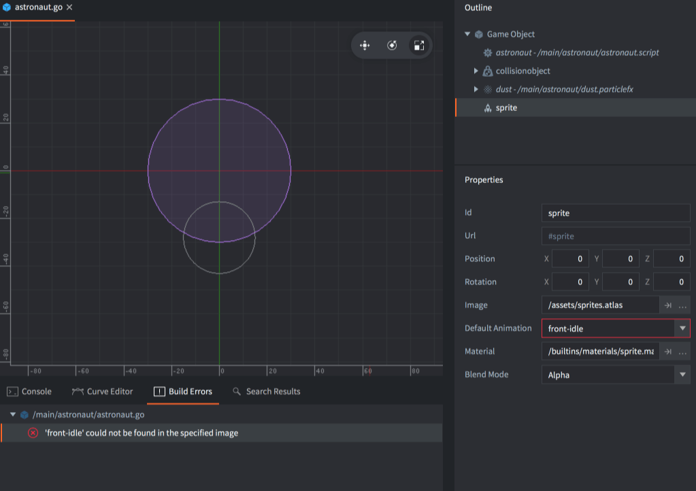

# Refactoring

Refactoring refers to the process of restructuring existing code and assets. During the development of a project, the need to change or move things around often surfaces: names need to change to adhere to naming conventions or to improve clarity and code or asset files need to move to a more logical place in the project hierarchy.

Defold helps you refactor efficiently by keeping track of how assets are used. It automatically updates references to assets that are renamed and/or moved. As a developer, you should feel free in your work. Your project is a flexible structure that you can change at will without fearing that everything will break and fall to pieces.

Automatic refactoring will only work if changes are made from within the editor. If you rename or move a file outside the editor any references to this file will not get automatically changed.

However, if you break a reference by, for instance, deleting an asset, the editor can't resolve the problem, but will provide helpful error signals. For example, if you delete an animation from an atlas and that animation is in use somewhere, Defold will signal an error when you try to start the game. The editor will also mark where the errors occur to help you quickly locate the problem:

Build errors appear in the *Build Errors* pane at the bottom of the editor. <kbd>Double clicking</kbd> an error takes you to the location of the problem.
